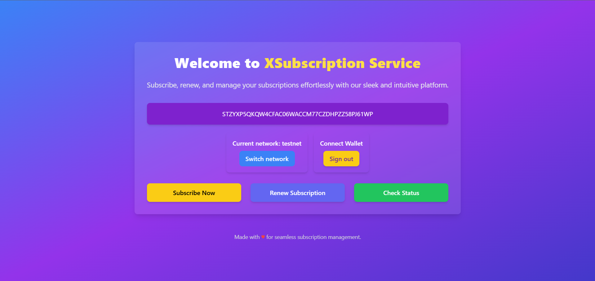

# Subscription Manager

## Overview

Subscription Manager is an innovative system built on the blockchain that allows users to access premium services by locking tokens for a specific period. This decentralized subscription model provides a secure and transparent way for content creators, online communities, and newsletter publishers to offer exclusive access to their services.

## Key Features
## Features

### Here’s a demo of the Homepage:

### Here’s a demo of the Subscription Page:

1. **Time-based Subscription Models**
   - Users can lock tokens for various durations (e.g., monthly, quarterly, annually)
   - Flexible subscription tiers with different benefits

2. **Auto-renewal with Notifications**
   - Automatic subscription renewal to ensure uninterrupted access
   - Timely notifications before renewal to allow users to opt-out if desired

3. **Early Renewal Incentives**
   - Discounts for early renewals to encourage user retention
   - Bonus rewards for long-term subscribers

4. **Token Locking Mechanism**
   - Secure smart contract for locking and releasing tokens
   - Transparent tracking of locked tokens and subscription status

